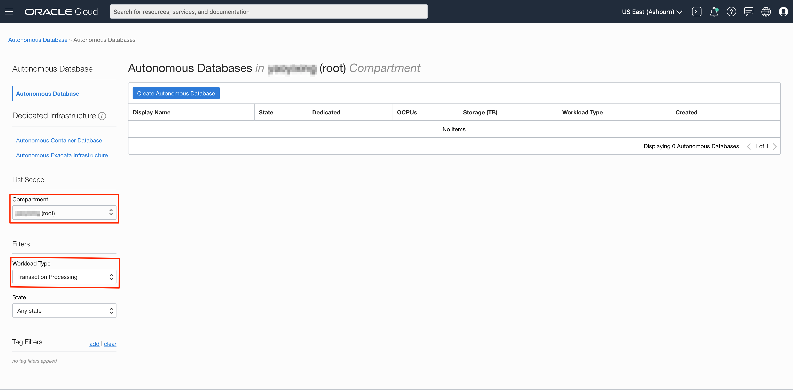
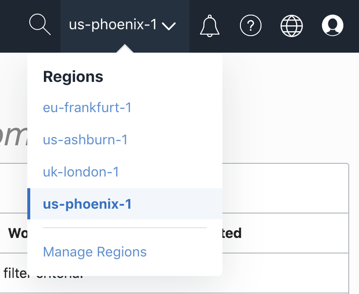
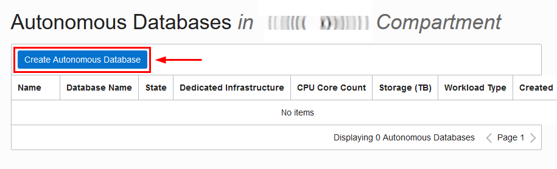
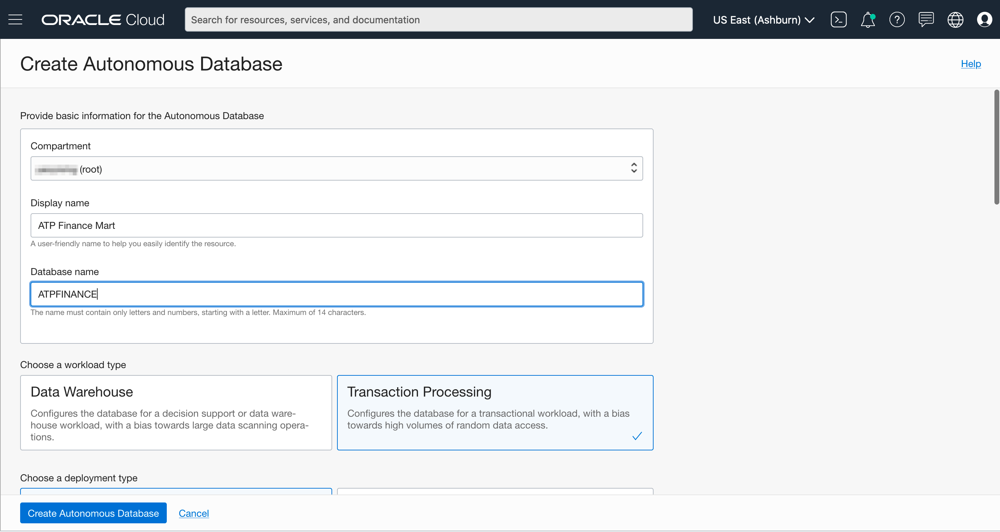
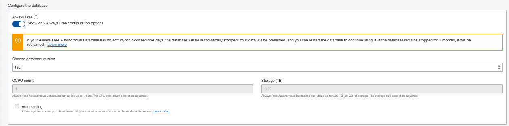

# Provision Autonomous Database Shared Free Tier Instance

## Introduction

This lab walks you through the steps to get started using the Oracle Autonomous Database (Autonomous Data Warehouse [ADW] and Autonomous Transaction Processing [ATP]) on Oracle Cloud. You will provision a new ATP instance using the cloud console.

*Note1: While this lab uses ATP, the steps are identical for creating and connecting to an ADW database.*

*Note2: If you want to create an Always Free autonomous database, you need to be in a region where Always Free Resources are available. (Not all regions have Always Free Resources)*

Estimated time: 5 minutes

Watch a video demonstration of provisioning an autonomous database in Autonomous Transaction Processing (same steps apply to provisioning an autonomous database in Autonomous Data Warehouse):

### Objectives

-   Learn how to provision a new free tier Autonomous Transaction Processing instance

### Prerequisites

* An [Oracle Cloud Account](https://www.oracle.com/cloud/free/). You may use your own cloud account, a cloud account that you obtained through a trial, a Free Tier account, or a training account whose details were given to you by an Oracle instructor.

## **STEP 1**: Choose ATP from the Services Menu

1. Login to the Oracle Cloud.

2. Once you are logged in, you are taken to the cloud services dashboard where you can see all the services available to you. Click the navigation menu in the upper left to show top level navigation choices.

    __Note:__ You can also directly access your Autonomous Data Warehouse or Autonomous Transaction Processing service in the __Quick Actions__ section of the dashboard.

    

3. The following steps apply similarly to either Autonomous Data Warehouse or Autonomous Transaction Processing. This lab shows provisioning of an Autonomous Transaction Processing (ATP) database, so click **Autonomous Transaction Processing**.

    

4. Make sure your Workload Type is __Transaction Processing__ or __All__ to see your Autonomous Transaction Processing instances. You can use the __List Scope__ drop-down menu to select a Compartment. Select your __root compartment__, or __another compartment of your choice__ where you will create your new ATP instance. If you want to create a new compartment or learn more about them, click [here](https://docs.cloud.oracle.com/iaas/Content/Identity/Tasks/managingcompartments.htm#three).

    *__Note__ - Avoid the use of the ManagedCompartmentforPaaS compartment as this is an Oracle default used for Oracle Platform Services.*

5. This console shows that no databases yet exist. If there were a long list of databases, you could filter the list by the __State__ of the databases (Available, Stopped, Terminated, and so on). You can also sort by __Workload Type__. Here, the __Transaction Processing__ workload type is selected.

    

6. You can see your current default **region** in the top, right hand corner of the page. You can select a different region. If you want to create an Always Free ADB, go ahead and select a region where Always Free Resources are available.

    

## **STEP 2**: Creating the ADB instance

1. Click **Create Autonomous Database** to start the instance creation process.

    

2.  This brings up the __Create Autonomous Database__ screen where you will specify the configuration of the instance.

3. Provide basic information for the autonomous database:

    - __Choose a compartment__ - Select a compartment for the database from the drop-down list.
    - __Display Name__ - Enter a memorable name for the database for display purposes. For this lab, use __ATP Graph__.
    - __Database Name__ - Use letters and numbers only, starting with a letter. Maximum length is 14 characters. (Underscores not initially supported.) For this lab, use __ATPGRAPH__.

4. Choose a workload type. Select the workload type for your database from the choices:

    - __Transaction Processing__ - For this lab, choose __Transaction Processing__ as the workload type.
    - __Data Warehouse__ - Alternately, you could have chosen Data Warehouse as the workload type.

    

5. Choose a deployment type. Select the deployment type for your database from the choices:

    - __Shared Infrastructure__ - For this lab, choose __Shared Infrastructure__ as the deployment type.
    - __Dedicated Infrastructure__ - Alternately, you could have chosen Dedicated Infrastructure as the workload type.

    

6. Configure the database, select the **Always Free** option:

    - __Always Free__ - For this lab, you can select this option to create an always free autonomous database, or not select this option and create a database using your paid subscription. An always free database comes with 1 CPU and 20 GB of storage. Selecting Always Free will suffice for this lab.
    - __Choose database version__ - Select a database version from the available versions.
    - __OCPU Count__ - Number of CPUs for your service. For this lab, choose an always free database, which comes with 1 CPU.
    - __Storage (TB)__ - Select your storage capacity in terabytes. For this lab, specify __1 TB__ of storage. Or, if you choose an always free database, it comes with 20 GB of storage.
    - __Auto scaling__ - For this lab, keep auto scaling should be **disabled**.
    - __New Database Preview__ - If a checkbox is available to preview a new database version, do __not__ select it.

    

7. Create administrator credentials:

    - __Password and Confirm Password__ - Specify the password for ADMIN user of the service instance. The password must meet the following requirements:
    - The password must be between 12 and 30 characters long and must include at least one uppercase letter, one lowercase letter, and one numeric character.
    - The password cannot contain the username.
    - The password cannot contain the double quote (") character.
    - The password must be different from the last 4 passwords used.
    - The password must not be the same password that is set less than 24 hours ago.
    - Re-enter the password to confirm it. Make a note of this password.

    

8. Choose network access:
    - For this lab, accept the default, "Allow secure access from everywhere".
    - If you want a private endpoint, to allow traffic only from the VCN you specify - where access to the database from all public IPs or VCNs is blocked, then select "Virtual cloud network" in the Choose network access area.
    - You can control and restrict access to your Autonomous Database by setting network access control lists (ACLs). You can select from 4 IP notation types: IP Address, CIDR Block, Virtual Cloud Network, Virtual Cloud Network OCID.

    

9. Choose a license type. For this lab, choose __License Included__. The two license types are:

    - __Bring Your Own License (BYOL)__ - Select this type when your organization has existing database licenses.
    - __License Included__ - Select this type when you want to subscribe to new database software licenses and the database cloud service.

10. Click __Create Autonomous Database__.

    

11.  Your instance will begin provisioning. In a few minutes the state will turn from Provisioning to Available. At this point, your Autonomous Transaction Processing database is ready to use! Have a look at your instance's details here including its Name, Database Version, OCPU Count and Storage size.

    

    

You may now proceed to the next lab.

## Want to Learn More?

Click [here](https://docs.oracle.com/en/cloud/paas/autonomous-data-warehouse-cloud/user/autonomous-workflow.html#GUID-5780368D-6D40-475C-8DEB-DBA14BA675C3) for documentation on the typical workflow for using Autonomous Data Warehouse.

## Acknowledgements

- **Author** - Nilay Panchal, ADB Product Management
- **Adapted for Cloud by** - Richard Green, Principal Developer, Database User Assistance
- **Last Updated By/Date** - Arabella Yao, Product Manager Intern, Database Management, July 2020

## Need Help?
Please submit feedback or ask for help using our [LiveLabs Support Forum](https://community.oracle.com/tech/developers/categories/oracle-graph). Please click the **Log In** button and login using your Oracle Account. Click the **Ask A Question** button to the left to start a *New Discussion* or *Ask a Question*.  Please include your workshop name and lab name.  You can also include screenshots and attach files.  Engage directly with the author of the workshop.

If you do not have an Oracle Account, click [here](https://profile.oracle.com/myprofile/account/create-account.jspx) to create one.
