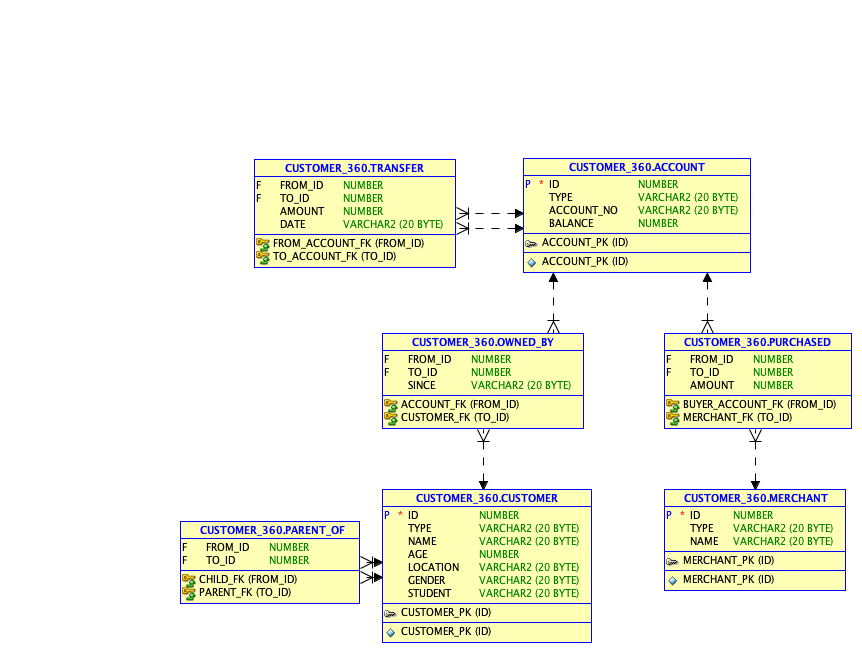
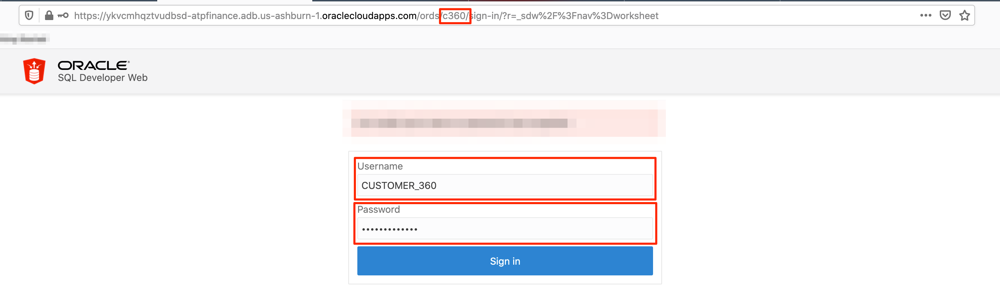
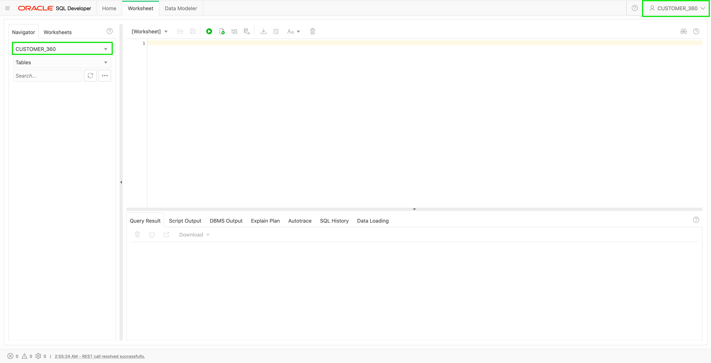

# Create and Populate Tables

## Introduction

In this lab, you are going to log in as user `hackmakers`. You will learn how to clear previous tables, create new tables, and populate the tables with your data.

You will create 3 tables (customer, account, transaction). The entity-relationship diagram for these tables is shown below.



Estimated time: 7 minutes

### Objectives

- Learn how to connect to your new Autonomous Database using SQL Developer Web
- Learn how to create tables and insert data using SQL

### Prerequisites

- This lab assumes you have successfully completed the lab - Create and enable a user in SQL Developer Web.

## **STEP 1:** Log in to SQL Developer Web

1. Open the correct URL for SQL Developer Web for the user. It is almost the same URL as the one for the Admin user execpt that `admin` in that url is replaced with the schema-alias we provided, i.e. with `hackmakers`.

  

2. Login as `hackmakers` using the password you entered when creating the user.

  *Note: Use the password you choose in Step 1.2 in Lab 4.*

  

  

## **STEP 2:** Drop existing tables if any

1. To ensure a clean slate, drop any existing tables. Copy, paste, and execute the following commands into the SQL Worksheet.

    ```
    <copy>
    DROP TABLE account;
    DROP TABLE customer;
    DROP TABLE transaction;
    </copy>
    ```


## **STEP 3:** Create and populate the account table

1. Go to 'Data Loading' tab and drop a file [`account.csv`](./data/account.csv).
2. Select the appropriate column types as below, and follow the wizard to import.

  

## **STEP 4:** Create and populate the customer table

1. Go to 'Data Loading' tab and drop a file [`customer.csv`](./data/customer.csv).
2. Select the appropriate column types as below, and follow the wizard to import.

  

## **STEP 5:** Create and populate the transaction table

1. Go to 'Data Loading' tab and drop a file [`transaction.csv`](./data/transaction.csv).
2. Select the appropriate column types as below, and follow the wizard to import.

  

## **STEP 6:** Create and populate the Merchant table

Try running this SQL query. This query find all transactions from the accounts owned by 'David'.

    SELECT
        C1.FIRST_NAME    AS SRC_FIRST_NAME,
        C2.LAST_NAME     AS SRC_LAST_NAME,
        T.DATETIME,
        T.AMOUNT,
        C2.FIRST_NAME    AS DST_FIRST_NAME,
        C2.LAST_NAME     AS DST_LAST_NAME
    FROM
        ACCOUNT      A1,
        ACCOUNT      A2,
        CUSTOMER     C1,
        CUSTOMER     C2,
        TRANSACTION  T
    WHERE
        C1.FIRST_NAME = 'David'
        AND C1.CST_ID = A1.CST_ID
        AND A1.ACC_ID = T.SRC_ACC_ID
        AND T.DST_ACC_ID = A2.ACC_ID
        AND A2.CST_ID = C2.CST_ID
    ORDER BY
        SRC_LAST_NAME,
        T.DATETIME

## Acknowledgements

* **Author** - Jayant Sharma, Product Manager, Spatial and Graph
* **Contributors** - Thanks to Jenny Tsai for helpful, constructive feedback that improved this workshop.
* **Last Updated By/Date** - Arabella Yao, Product Manager Intern, Database Management, June 2020

## Need Help?
Please submit feedback or ask for help using our [LiveLabs Support Forum](https://community.oracle.com/tech/developers/categories/oracle-graph). Please click the **Log In** button and login using your Oracle Account. Click the **Ask A Question** button to the left to start a *New Discussion* or *Ask a Question*.  Please include your workshop name and lab name.  You can also include screenshots and attach files.  Engage directly with the author of the workshop.

If you do not have an Oracle Account, click [here](https://profile.oracle.com/myprofile/account/create-account.jspx) to create one.
