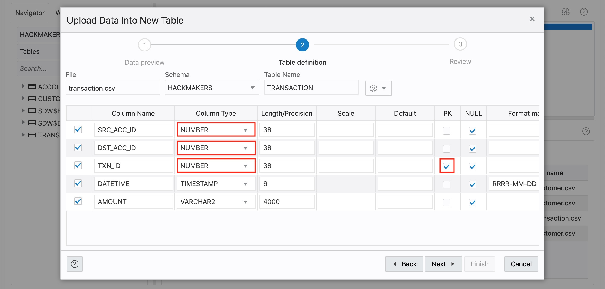

# Create and Populate Tables

## Introduction

In this lab, you are going to log in as user `hackmakers`. You will learn how to clear previous tables, create new tables, and populate the tables with your data.

You will create 3 tables (customer, account, transaction).

Estimated time: 7 minutes

### Objectives

- Learn how to connect to your new Autonomous Database using SQL Developer Web
- Learn how to create tables and insert data using SQL

### Prerequisites

- This lab assumes you have successfully completed the lab - Create and enable a user in SQL Developer Web.

## **STEP 1:** Log in to SQL Developer Web

1. Open the correct URL for SQL Developer Web for the user. It is almost the same URL as the one for the Admin user execpt that `admin` in that url is replaced with the schema-alias we provided, i.e. with `hackmakers`.

  

2. Login as `hackmakers` using the password you entered when creating the user.

  

## **STEP 2:** Drop existing tables if any

To ensure a clean slate, drop any existing tables. Copy, paste, and execute the following commands into the SQL Worksheet.

    DROP TABLE account;
    DROP TABLE customer;
    DROP TABLE transaction;

## **STEP 3:** Create and populate the account table

1. Go to 'Data Loading' tab and drop a file [`account.csv`](https://raw.githubusercontent.com/ryotayamanaka/hackmakers/main/data/account.csv).
2. Select the appropriate **column types** and **PK** as below. 
3. Follow the wizard to import.

  

## **STEP 4:** Create and populate the customer table

1. Go to 'Data Loading' tab and drop a file [`customer.csv`](https://raw.githubusercontent.com/ryotayamanaka/hackmakers/main/data/customer.csv).
2. Select the appropriate **column types** and **PK** as below. 
3. Follow the wizard to import.

  

## **STEP 5:** Create and populate the transaction table

1. Go to 'Data Loading' tab and drop a file [`transaction.csv`](https://raw.githubusercontent.com/ryotayamanaka/hackmakers/main/data/transaction.csv).
2. Select the appropriate **column types** and **PK** as below. 
3. Follow the wizard to import.

  

## **STEP 6:** Create and populate the Merchant table

Try running this SQL query. This query find all transactions from the accounts owned by 'David'.

    SELECT c1.first_name AS src_first_name, c1.last_name AS src_last_name, t.datetime, t.amount,
           c2.first_name AS dst_first_name, c2.last_name AS dst_last_name
    FROM account a1, account a2, customer c1, customer c2, transaction t
    WHERE c1.first_name = 'David'
      AND c1.cst_id = a1.cst_id
      AND a1.acc_id = t.src_acc_id
      AND t.dst_acc_id = a2.acc_id
      AND a2.cst_id = c2.cst_id
    ORDER BY src_last_name, t.datetime

## Acknowledgements

* **Original Author** - Jayant Sharma, Product Manager, Spatial and Graph
* **Contributors** - Thanks to Jenny Tsai for helpful, constructive feedback that improved this workshop.
