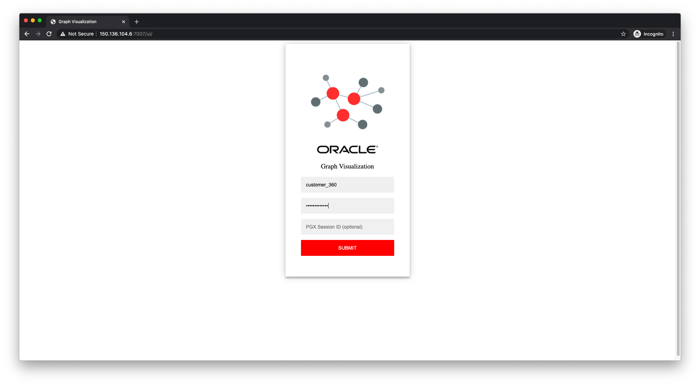
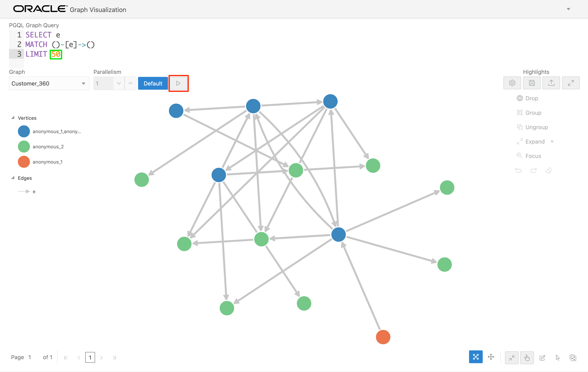
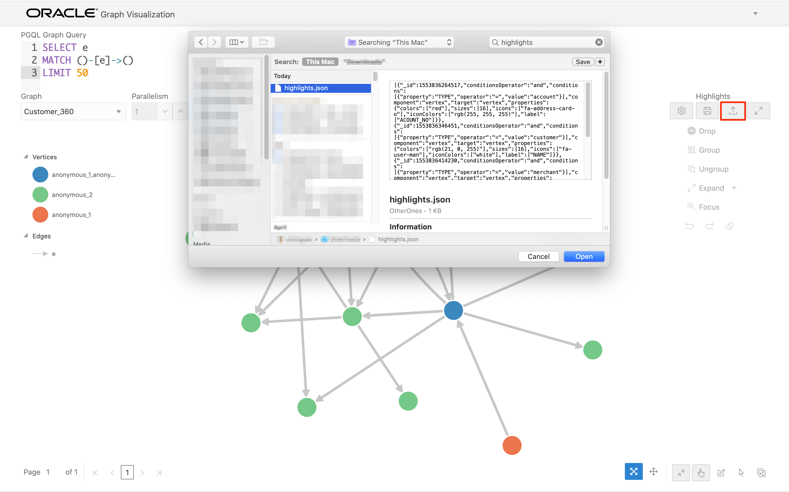

# Graph Visualization

## Introduction

The results of the analyses done in the previous labs can easily be visualized using Graph Visualization feature.

Estimated time: 5 minutes

The following video provides an overview of the visualization component.

### Objectives

- Learn how to execute PGQL graph queries and visualize the results.

### Prerequisites

- This lab assumes you have successfully completed Lab - Graph Query and Analysis with JShell and published the graph. It also assumes the Graph Visualization component is up and running on the compute instance on `public_ip_for_compute:7007/ui`. We will use the Graph Visualization component to explore the graph and run some PGQL queries.

## **STEP 1:** Get the Session ID

To log in with the same session as the Python client which is holding the graph, get the session ID.

    >>> session
    PgxSession(id: 3f7996d2-c1a8-4af3-94ba-51e5f105a5ea, name: python_pgx_client)

## **STEP 2:** Log into Graph Visualization

1. Open the Graph Viz at `http://<public_ip_for_compute>:7007/ui`. Replace `<public_ip_for_compute>` with the one for your Graph Server compute instance.

    You should see a screen similar to the screenshot below.  Enter the username (`hackmakers`), password, and the session ID above.

    

## **STEP 3:** Modify query

1. Modify the query to get the first 50 rows, i.e. change LIMIT 10 to LIMIT 50, and click Run.

    You should see a graph similar to the screenshot below.

    

## **STEP 4:** Add highlights

Now let's add some labels and other visual context. These are known as highlights. Click [here](https://objectstorage.us-ashburn-1.oraclecloud.com/p/o49GH8NXlnrwgfbWO9cDCq-zqhsFBHFNGRGM6uHwnEQkHUH5fo5X-u33SW4H_22J/n/c4u03/b/data-management-library-files/o/highlights.json.zip) to download the highlights.json zip file. Unzip the file and note where it is unzipped.

1. Click on the Load button under Highlights (on the right side of the screen). Browse to the appropriate folder (i.e. either to `oracle-pg/graphs/customer_360`  or the folder where you just downloaded it) and choose the file named 'highlights.json' and click Open to load that.

    

    The graph should now look like

    

## Acknowledgements

* **Original Author** - Jayant Sharma, Product Manager, Spatial and Graph.
* **Contributors** - Arabella Yao, Product Manager Intern, Database Management, and Jenny Tsai.
