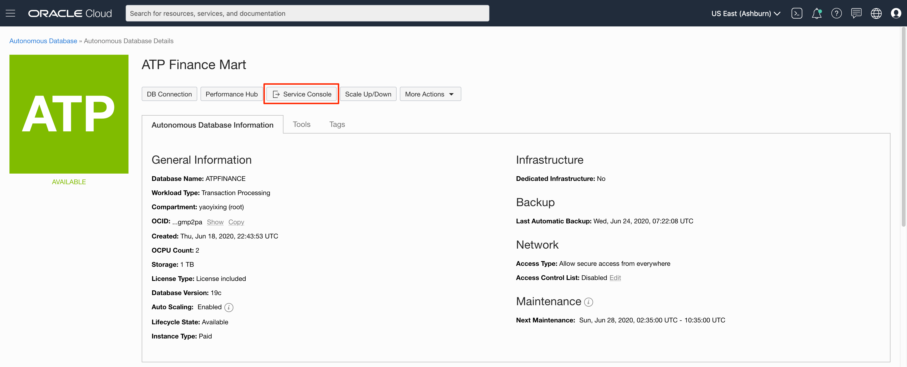
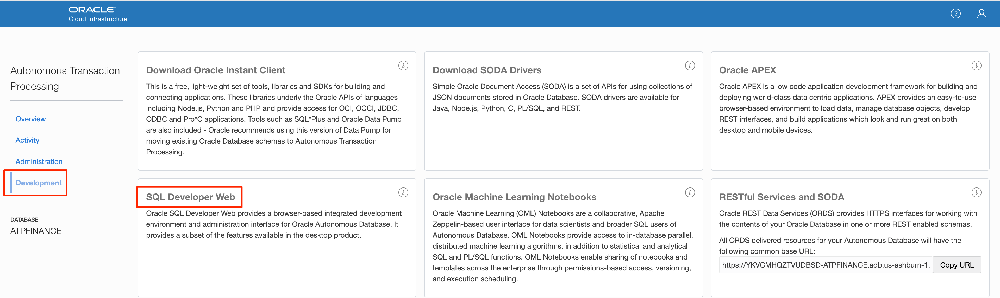
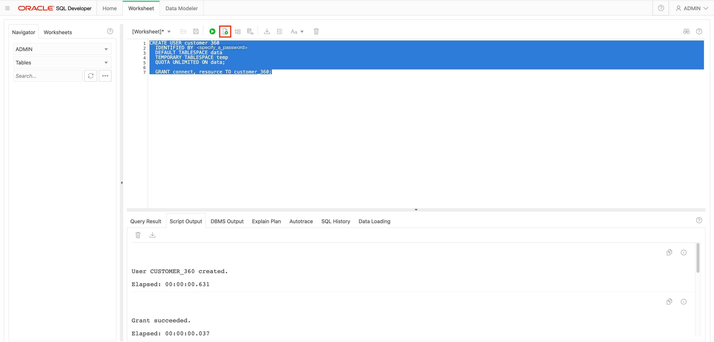
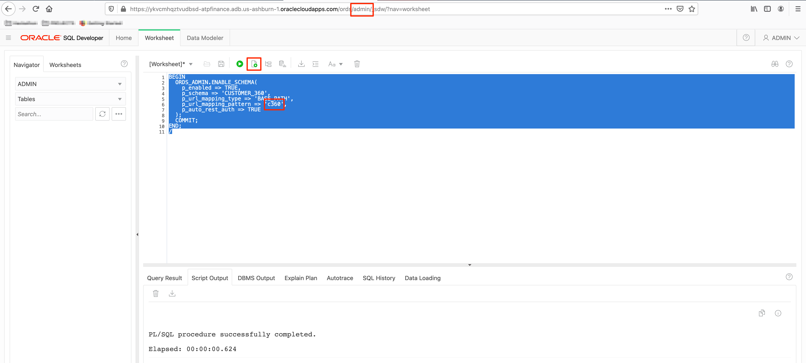

# Create and Enable a Graph User in SQLDeveloper Web

## Introduction

This lab walks you through the steps to get started with SQL Developer Web. You will learn how to create a user in SQL Developer Web and provide that user the access to SQL Developer Web.

Estimated time: 3 minutes

### Objectives

- Learn how to create a database user in SQLDeveloperWeb.

### Prerequisites

* Oracle cloud account
* Provisioned Autonomous Database Shared Free Tier Instance

## **STEP 1:** Create the Customer_360 user

1. Login as the Admin user in SQLDevWeb of the newly created ADB Free Tier instance.

  Go to your Cloud Console, click **Autonomous Transaction Processing**. Select the ADB instance **ATP Graph** you created in Lab 2.

  

  In Autonomous Database Details page, click **Service Console**. Make sure your brower allow pop-up windows.

  

  Choose Development from the list on the left, then click the **SQL Developer Web**.

  

  Enter `ADMIN` as Username, and the enter the password you set up at Lab 2 Step 2, Section 7.

  
  Login as the ADMIN user. 

  

2. Now create the `CUSTOMER_360` user. Enter the following commands into the SQL Worksheet and run it while connected as the Admin user.

  Note: Replace **<specify_a_password>** with a valid password string after copying and pasting the text below but **before executing** it in SQLDeveloperWeb.

    ```
    <copy>
    CREATE USER customer_360 
    IDENTIFIED BY <specify_a_password> 
    DEFAULT TABLESPACE data 
    TEMPORARY TABLESPACE temp 
    QUOTA UNLIMITED ON data;  

    CREATE ROLE GRAPH_DEVELOPER;
    CREATE ROLE GRAPH_ADMINISTRATOR;

    GRANT connect, resource, graph_developer TO customer_360;
    </copy>
    ```

  

  *Notes:* 
  - *The `IDENTIFIED BY` clause specifies the password (i.e whatever you replaced <specify_a_password> with)*
  - *Since [20.3 the Graph Server uses database authentication](https://docs.oracle.com/en/database/oracle/oracle-database/20/spgdg/using-inmemory-analyst-oracle-database.html). The user needs at least the graph_developer role.*

## **STEP 2:** Enable SQLDevWeb for Customer_360

1. Now provide SQLDevWeb access for this user. See the [documentation](https://docs.oracle.com/en/cloud/paas/autonomous-data-warehouse-cloud/user/sql-developer-web.html#GUID-4B404CE3-C832-4089-B37A-ADE1036C7EEA)
  for details.

  First clear the previous text in the SQL Worksheet.

  Copy and paste the following text into the SQL Worksheet and run it.

    ```
    <copy>
    BEGIN
      ORDS_ADMIN.ENABLE_SCHEMA(
        p_enabled => TRUE,
        p_schema => 'CUSTOMER_360',
        p_url_mapping_type => 'BASE_PATH',
        p_url_mapping_pattern => 'c360',
        p_auto_rest_auth => TRUE
      );
      COMMIT;
    END;
    /
    </copy>
    ```

  

  The URL for SQLDeveloperWeb for the Customer_360 user will have `c360` in place of `admin` in it.

  Save the URL for the next step.

  For details, see the ["Provide SQL Developer Web Access to Database Users"](https://docs.oracle.com/en/cloud/paas/autonomous-data-warehouse-cloud/user/sql-developer-web.html#GUID-4B404CE3-C832-4089-B37A-ADE1036C7EEA) section in the documentation.


  You may now proceed to the next lab.

## Acknowledgements ##

* **Author** - Jayant Sharma, Product Manager, Spatial and Graph.
* **Contributors** - Thanks to Jenny Tsai for helpful, constructive feedback that improved this workshop. Arabella Yao, Product Manager Intern, Database Management.
* **Last Updated By/Date** - Jayant Sharma, October 2020

## Need Help?
Please submit feedback or ask for help using our [LiveLabs Support Forum](https://community.oracle.com/tech/developers/categories/oracle-graph). Please click the **Log In** button and login using your Oracle Account. Click the **Ask A Question** button to the left to start a *New Discussion* or *Ask a Question*.  Please include your workshop name and lab name.  You can also include screenshots and attach files.  Engage directly with the author of the workshop.

If you do not have an Oracle Account, click [here](https://profile.oracle.com/myprofile/account/create-account.jspx) to create one.
