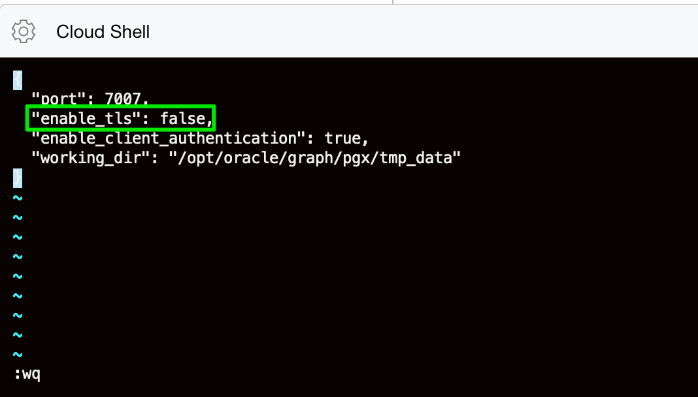
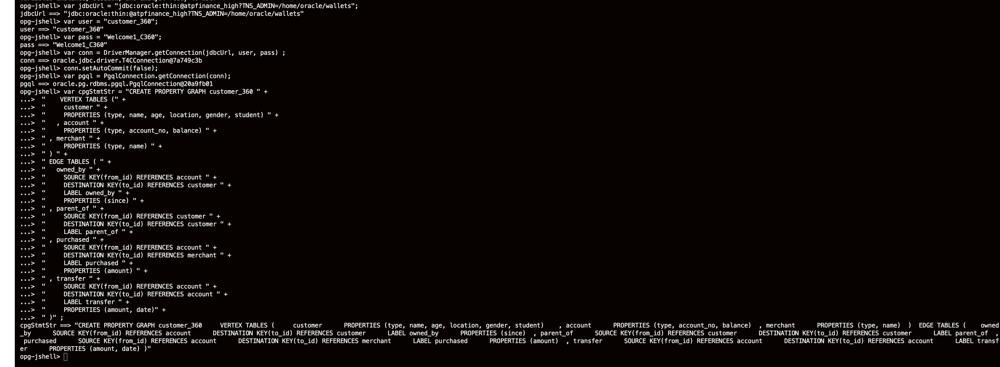
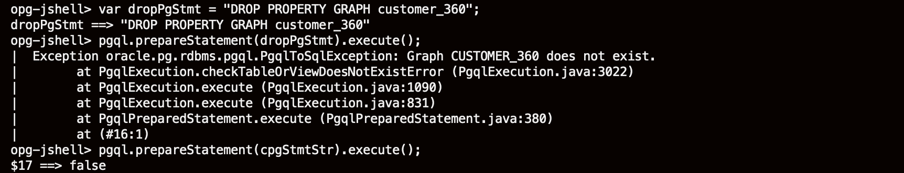
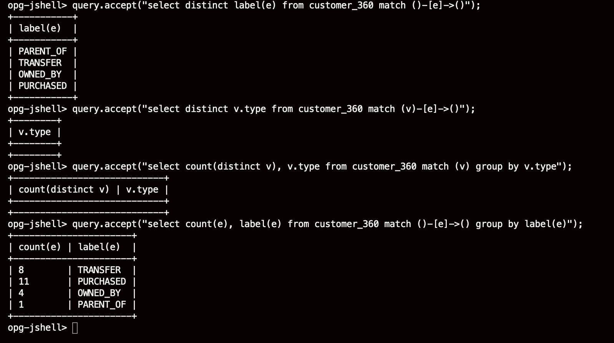

# Create the Graph

## Introduction

Now, the tables are created and populated with data. Let's create a Customer_360 graph representation of them.

Estimated time: 5 minutes

### Objectives

Learn how to create a graph from relational data sources by:
- Modifying the graph server configuration to disable Transport Layer Security (TLS) / Secure Sockets Layer (SSL) for this lab
- Checking the JDBC URL and modify if needed
- Modifying a default grant setting for publishing a graph
- Restarting the graph server
- Starting a client (JShell) that connects to the server
- Setup a Property Graph Query Language (PGQL) connection to the database
- Using PGQL Data Definition Language (DDL) (e.g. CREATE PROPERTY GRAPH) to instantiate a graph

### Prerequisites

- This lab assumes you have successfully completed the lab - Create and populate tables.

## **STEP 1:** Modify the graph server config file

1. SSH into the compute instance where you installed the graph server.

  First navigate to the folder where you created your SSH Keys. And connect using:

    ```
    <copy>ssh -i &lt;private_key> opc@&lt;public_ip_for_compute></copy>
    ```

2. Then edit the `/etc/oracle/graph/server.conf` file.

    ```
    <copy>vi /etc/oracle/graph/server.conf</copy>
    ```

    Change the line
    ` "enable_tls": true,`
    to
    ` "enable_tls": false,`

3. Save the file and exit.

    

4. Edit the Graph Server (PGX) config file.

    ```
    <copy>vi /etc/oracle/graph/pgx.conf</copy>
    ```

   Modify the line
   `"grant": "PGX_SESSION_GET_PUBLISHED_GRAPH"`
   to
   `"grant": "PGX_SESSION_ADD_PUBLISHED_GRAPH"`
   in the entry for `"pgx_role": "GRAPH_DEVELOPER"`.

   Check the `"jdbc_url"` value in the `"pgx_realm"` entry and update it if necessary.

## **STEP 2:** Restart the graph server

1. Starting with version 20.3 the Graph Server is started, stopped, or restarted with systemctl.

   Check it's status and restart or start it as follows.

    ```
    <copy>
    systemctl status pgx
    sudo systemctl restart pgx
    </copy>
    ```

## **STEP 3:** Start a client shell

1. Once the graph server is up and running start a client shell to access it. This is based on `jshell` and requires JDK 11.  Version 20.3 also has a new authentication mechanism that requires a token to be used in all requests from the client to the graph server.

    Albert Godfrind has written some utility scripts and Java methods that simplify the process. We will use his graph token shell utility in this workshop.

    Download the code from his [Git repo](https://github.com/agodfrind/graph-token-shell) (https://github.com/agodfrind/graph-token-shell).

    Copy it to the compute instance like you copied the ADB Wallet. e.g. on your machine

    ```
    <copy>scp -i private_key ~/Downloads/graph-token-shell.zip opc@public_ip_for_compute:/home/opc</copy>
    ```

2. Unzip the shell utility you copied above on the compute instance that you ssh'd into.

    ```
    <copy>unzip graph-token-shell.zip</copy>
    ```

3. Then start a client shell instance that connects to the server

    ```
    <copy>
    cd graph-token-shell
    ./opg-jshell --base_url http://localhost:7007 -u customer_360 -p Welcome1_C360</copy>
    ```

    You should see the following if the client shell starts up successfully.

    ```
    For an introduction type: /help intro
    Oracle Graph Server Shell 20.3.0
    PGX server version: 20.1.1 type: SM
    PGX server API version: 3.8.1
    PGQL version: 1.3
    Variables instance, session, and analyst ready to use.
    opg-jshell>
    ```

## **STEP 4:** Create the graph

The username and password in the step above was just used to get an authentication token for the graph client. It does not set up a database connection. That will be done below in order to create a graph from the database tables.

Enter the following sets of commands in the JShell.

1. First setup the database connection. Enter the following into the JShell.

    Replace *{db\_tns\_name}* with the appropriate database service name in the tnsnames.ora file of the wallet (e.g. `atpfinance_low`, if you follow the previous labs exactly).
    *Please refer back to Lab 4, Step 4, to check the content of `tnsnames.ora` file.*

    Replace *{wallet_location}* with the full path to the directory which has the unzipped wallet (e.g. `/home/oraclegraph/wallets`).

    ```
    <copy>var jdbcUrl = "jdbc:oracle:thin:@{db_tns_name}?TNS_ADMIN={wallet_location}";</copy>
    ```

    ```
    <copy>var user = "customer_360";</copy>
    ```

    ```
    <copy>var pass = "Welcome1_C360";</copy>
    ```

    ```
    <copy>var conn = DriverManager.getConnection(jdbcUrl, user, pass) ;</copy>
    // example jshell output
    // conn ==> oracle.jdbc.driver.T4CConnection@54d11c70
    ```

2. Then create a PGQL connection and set its properties.

    ```
    // Get a PGQL connection in order to run PGQL statements
    // Set auto commit to false for PGQL
    <copy>conn.setAutoCommit(false);</copy>
    ```

    ```
    <copy>var pgql = PgqlConnection.getConnection(conn);</copy>

    // example jshell output
    // pgql ==> oracle.pg.rdbms.pgql.PgqlConnection@6493f780
    ```

3. Next set up the create property graph statement.

    ```
    
    // create the graph from the existing tab
    <copy>
    var cpgStmtStr = "CREATE PROPERTY GRAPH customer_360 " +
    "    VERTEX TABLES (" +
    "     customer " +
    "     PROPERTIES (type, name, age, location, gender, student) " +
    "   , account " +
    "     PROPERTIES (type, account_no, balance) " +
    " , merchant " +
    "     PROPERTIES (type, name) " +
    " ) " +
    " EDGE TABLES ( " +
    "   owned_by " +
    "     SOURCE KEY(from_id) REFERENCES account " +
    "     DESTINATION KEY(to_id) REFERENCES customer " +
    "     LABEL owned_by " +
    "     PROPERTIES (since) " +
    " , parent_of " +
    "     SOURCE KEY(from_id) REFERENCES customer " +
    "     DESTINATION KEY(to_id) REFERENCES customer " +
    "     LABEL parent_of " +
    " , purchased " +
    "     SOURCE KEY(from_id) REFERENCES account " +
    "     DESTINATION KEY(to_id) REFERENCES merchant " +
    "     LABEL purchased " +
    "     PROPERTIES (amount) " +
    " , transfer " +
    "     SOURCE KEY(from_id) REFERENCES account " +
    "     DESTINATION KEY(to_id) REFERENCES account " +
    "     LABEL transfer " +
    "     PROPERTIES (amount, date)" +
    " )" ;
    </copy>
    // example jshell output
    // cpgStmtStr ==> "CREATE PROPERTY GRAPH customer_360     VERTEX TABLES (     customer      PROPERTIES (type, name, age, location, gender, student)    , account      PROPERTIES (type, account_no, balance)  , merchant      PROPERTIES (type, name)  )  EDGE TABLES (    owned_by      SOURCE KEY(from_id) REFERENCES account      DESTINATION KEY(to_id) REFERENCES customer      LABEL owned_by      PROPERTIES (since)  , parent_of      SOURCE KEY(from_id) REFERENCES customer      DESTINATION KEY(to_id) REFERENCES customer      LABEL parent_of  , purchased      SOURCE KEY(from_id) REFERENCES account      DESTINATION KEY(to_id) REFERENCES merchant      LABEL purchased      PROPERTIES (amount)  , transfer      SOURCE KEY(from_id) REFERENCES account      DESTINATION KEY(to_id) REFERENCES account      LABEL transfer      PROPERTIES (amount, date) )"
    ```

    

4. Now execute the PGQL DDL to first DROP any existing graph of the same name before CREATEing it.

    ```
    <copy>var dropPgStmt = "DROP PROPERTY GRAPH customer_360";</copy>
    ```

    ```
    // drop any existing garph
    <copy>pgql.prepareStatement(dropPgStmt).execute();</copy>
    ```

    ```
    // Now create the graph 
    <copy>pgql.prepareStatement(cpgStmtStr).execute();</copy>
    // example jshell output
    // $12 ==> false
    ```

    The create graph process can take 3-4 minutes depending on various factors such as network bandwidth and database load.

    

## **STEP 5:** Check the newly created graph

Check that the graph was created. Copy, paste, and run the following statements in the JShell.

1. Copy the following code, paste, and execute it in the JShell.

    ```
    // create a helper method for preparing, executing, and printing the results of PGQL statements
    <copy>Consumer&lt;String&gt; query = q -> { try(var s = pgql.prepareStatement(q)) { s.execute(); s.getResultSet().print(); } catch(Exception e) { throw new RuntimeException(e); } }</copy>
    // sample jshell output
    // query ==> $Lambda$583/0x0000000800695c40@65021bb4
    ```

2. Then copy, paste, and execute the following.

    ```
    // query the graph

    // what are the edge labels i.e. categories of edges
    <copy>query.accept("select distinct label(e) from customer_360 match ()-[e]->()");</copy>
    ```

    ```
    // what are the vertex types i.e. values of the property named "type"
    <copy>query.accept("select distinct v.type from customer_360 match (v)-[e]->()");</copy>
    ```

    ```
    // how many vertices with each type/category
    <copy>query.accept("select count(distinct v), v.type from customer_360 match (v) group by v.type");</copy>
    ```

    ```
    // how many edges with each label/category
    <copy>query.accept("select count(e), label(e) from customer_360 match ()-[e]->() group by label(e)");</copy>
    ```

    

You may now proceed to the next lab (query and analyse the graph in JShell.

## Acknowledgements

* **Author** - Jayant Sharma, Product Manager, Spatial and Graph

* **Contributors** - Thanks to Jenny Tsai for helpful, constructive feedback that improved this workshop. Arabella Yao, Product Manager Intern, Database Management
- **Last Updated By/Date** - Jayant Sharma, October 2020

## Need Help?
Please submit feedback or ask for help using our [LiveLabs Support Forum](https://community.oracle.com/tech/developers/categories/oracle-graph). Please click the **Log In** button and login using your Oracle Account. Click the **Ask A Question** button to the left to start a *New Discussion* or *Ask a Question*.  Please include your workshop name and lab name.  You can also include screenshots and attach files.  Engage directly with the author of the workshop.

If you do not have an Oracle Account, click [here](https://profile.oracle.com/myprofile/account/create-account.jspx) to create one.
