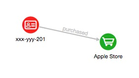
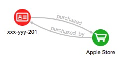

# Graph Query and Analysis with JShell

## Introduction

This example shows how integrating multiple datasets and using a graph facilitate additional analytics and can lead to new insights. We will use three small datasets for illustrative purposes. The first contains accounts and account  owners. The second is purchases by the people who own those accounts. The third is transactions between these accounts.

The combined dataset is then used to perform the following common graph query and analyses: pattern matching, detection of cycles, finding important nodes, community detection, and recommendation.

The following ER diagram depicts the relationships between the datasets.


Estimated Lab Time: 10 minutes

### Objectives

- Learn how to query and analyze the Customer 360 graphs with the Graph Server and Client kit.

### Prerequisites

- This lab assumes you have successfully completed all the previous Labs (Lab 1 through Lab 6) and have the client JShell up and running.

## **STEP 1:** Load Graph into Memory

1. Check to see which graphs have been loaded into the graph server.

    ```
    opg-jshell> <copy>session.getGraphs();</copy>
    ```

2. If the `Customer_360` graph exists in the in-memory graph server, then load it into the client shell.
    ```
    opg-jshell> <copy>var graph = session.getGraph("Customer_360");</copy>
    ```

3. If it does *NOT* exist, then read it from the database.

    ```
    opg-jshell> session.getGraphs();
    $1 ==> {}
    ```

  The necessary steps are:
  ***Note: The following are not needed if you are continuing in the same client shell. If so all the foloowing variables will alreayd exist. If so then skip to Step 4.***
     - Set up the Java Database Connectivity (JDBC) connection. *Modify the URL for your instance*
      For `{db_service}`, use database service name (e.g. atpfinance_high) from the tnsnames file in the ADB Wallet you downloaded when setting up your ADB instance.
      For `{wallet_location}`, specify the directory (e.g. /home/oracle/wallets) where you unzipped the downlaoded wallet in the compute instance.
     - Specify a graph config.
     - Read the graph into memory.

    ```
    opg-jshell> <copy>var jdbcUrl = "jdbc:oracle:thin:@{db_service}?TNS_ADMIN={unzipped_wallet_location}";</copy>
    // example output: jdbcUrl ==> "jdbc:oracle:thin:@atpfinance_low?TNS_ADMIN=/home/oraclegraph/wallets"
    ```
    *If you have any questions in JDBC connection, please refer back to Lab 4, Step 4 for more information.*

    ```
    opg-jshell> <copy>var user = "customer_360";</copy>
    user ==> "customer_360"
    ```

    Replace `<specify_a_password>` with the correct password string for the database user `customer_360'.
    ```
    opg-jshell> <copy>var pass = "<specify_a_password>";</copy>
    pass ==> "<specify_a_password>"
    ```

    ```
    opg-jshell> <copy>var conn = DriverManager.getConnection(jdbcUrl, user, pass) ;</copy>
    conn ==> oracle.jdbc.driver.T4CConnection@54d11c70
    ```

4. Now, load the graph into memory to run some more analyses. Specify the graph config (i.e. vertex and edge properties and datatypes).
   Copy, paste, and execute the following code in JShell.

    ```
    opg-jshell> <copy>Supplier&lt;GraphConfig&gt; pgxConfig = () -> { return GraphConfigBuilder.forPropertyGraphRdbms()
    .setJdbcUrl(jdbcUrl)
    .setUsername(user)
    .setPassword(pass)
    .setName("Customer_360")
    .addVertexProperty("TYPE", PropertyType.STRING)
    .addVertexProperty("NAME", PropertyType.STRING)
    .addVertexProperty("LOCATION", PropertyType.STRING)
    .addVertexProperty("GENDER", PropertyType.STRING)
    .addVertexProperty("STUDENT", PropertyType.STRING)
    .addVertexProperty("ACCOUNT_NO", PropertyType.STRING)
    .addVertexProperty("AGE", PropertyType.INTEGER)
    .addVertexProperty("BALANCE", PropertyType.DOUBLE)
    .addEdgeProperty("SINCE", PropertyType.STRING)
    .addEdgeProperty("DATE", PropertyType.STRING)
    .addEdgeProperty("AMOUNT", PropertyType.DOUBLE)
    .setLoadVertexLabels(true)
    .setLoadEdgeLabel(true)
    .setKeystoreAlias("alias")
    .build(); }
    </copy>
    pgxConfig ==> $Lambda$607/0x0000000800add440@616d9a6d
    ```

5. Load the graph. Can take 1-2 minutes depending on network bandwidth.

    ```
    opg-jshell> <copy>var graph = session.readGraphWithProperties(pgxConfig.get()) ;</copy>
    graph ==> PgxGraph[name=Customer_360,N=15,E=24,created=1591215633384]
    ```

Now we can query this graph and run some analyses on it.

## **STEP 2:** Pattern Matching

PGQL Query is convenient for detecting specific patterns.

1. Find accounts that had an inbound and an outbound transfer, of over 500, on the same day. The PGQL query for this is:

    ```
    opg-jshell> <copy>graph.queryPgql(
      " SELECT a.ACCOUNT_NO, a.BALANCE, t1.AMOUNT, t2.AMOUNT, t1.DATE " +
      " MATCH (a)<-[t1:TRANSFER]-(a1) " +
      "    , (a)-[t2:TRANSFER]->(a2) " +
      " WHERE t1.DATE = t2.DATE " +
      "  AND t1.AMOUNT > 500 " +
      "  AND t2.AMOUNT > 500 "
    ).print();
    </copy>

    +---------------------------------------------------------------+
    | a.account_no | a.balance | t1.amount | t2.amount | t1.date    |
    +---------------------------------------------------------------+
    | xxx-yyy-202  | 200       | 900       | 850       | 2018-10-06 |
    +---------------------------------------------------------------+
    $8 ==> PgqlResultSetImpl[graph=Customer_360,numResults=1]
    ```

## **STEP 3:** Detection of Cycles

Next we use PGQL to find a series of transfers that start and end at the same account, such as A to B to A, or A to B to C to A.

1. The first query could be expressed as:

    ```
    opg-jshell> <copy>graph.queryPgql(
    "  SELECT a1.ACCOUNT_NO, t1.DATE, t1.AMOUNT, a2.ACCOUNT_NO, t2.DATE, t2.AMOUNT " +
    "  MATCH (a1)-[t1:TRANSFER]->(a2)-[t2:TRANSFER]->(a1) " +
    " WHERE t1.DATE < t2.DATE"
    ).print();
    </copy>

    +---------------------------------------------------------------------------------+
    | a1.account_no | t1.date    | t1.amount | a2.account_no | t2.date    | t2.amount |
    +---------------------------------------------------------------------------------+
    | xxx-yyy-201   | 2018-10-05 | 200       | xxx-yyy-202   | 2018-10-10 | 300       |
    +---------------------------------------------------------------------------------+
    $9 ==> PgqlResultSetImpl[graph=Customer_360,numResults=1]
    ```

  

2. The second query just adds one more transfer to the pattern (list) and could be expressed as:


    ```
    opg-jshell> <copy>graph.queryPgql(
    "  SELECT a1.ACCOUNT_NO, t1.AMOUNT, a2.ACCOUNT_NO, t2.AMOUNT " +
    "       , a3.ACCOUNT_NO, t3.AMOUNT " +
    "  MATCH (a1)-[t1:TRANSFER]->(a2)-[t2:TRANSFER]->(a3)-[t3:TRANSFER]->(a1) " +
    "  WHERE t1.DATE < t2.DATE " +
    "    AND t2.DATE < t3.DATE "
    ).print();
    </copy>

    +-----------------------------------------------------------------------------------+
    | a1.account_no | t1.amount | a2.account_no | t2.amount | a3.account_no | t3.amount |
    +-----------------------------------------------------------------------------------+
    | xxx-yyy-201   | 500       | xxx-yyy-203   | 400       | xxx-yyy-204   | 300       |
    +-----------------------------------------------------------------------------------+
    $10 ==> PgqlResultSetImpl[graph=Customer_360,numResults=1]
    ```

  

## **STEP 4:** Influential Accounts

1. Filter customers from the graph. (cf. [Filter Expressions](https://docs.oracle.com/cd/E56133_01/latest/prog-guides/filter.html))

    ```
    opg-jshell> <copy>var sg = graph.filter(new EdgeFilter("edge.label()='TRANSFER'")); </copy>
    sg ==> PgxGraph[name=sub-graph_4,N=6,E=8,created=1593647400468]
    ```

2. Run [PageRank Algorithm](https://docs.oracle.com/cd/E56133_01/latest/reference/analytics/algorithms/pagerank.html). PageRank Algorithm assigns a numeric weight to each vertex, measuring its relative importance within the graph.

    ```
    opg-jshell> <copy>analyst.pagerank(sg); </copy>
    $12 ==> VertexProperty[name=pagerank,type=double,graph=sub-graph_4]
    ```

3. Show the result.

    ```
    opg-jshell> <copy>sg.queryPgql(
    " SELECT a.ACCOUNT_NO, a.PAGERANK " +
    " MATCH (a) " +
    " ORDER BY a.PAGERANK DESC "
    ).print();
    </copy>

    +-------------------------------------+
    | a.account_no | a.pagerank           |
    +-------------------------------------+
    | xxx-yyy-201  | 0.18012007557258927  |
    | xxx-yyy-204  | 0.1412461615467829   |
    | xxx-yyy-203  | 0.1365633635065475   |
    | xxx-yyy-202  | 0.12293884324085073  |
    | xxx-zzz-212  | 0.05987452026569676  |
    | xxx-zzz-211  | 0.025000000000000005 |
    +-------------------------------------+
    $13 ==> PgqlResultSetImpl[graph=sub-graph_4,numResults=6]
    ```

## **STEP 5:** Community Detection

Let's find which subsets of accounts form communities. That is, there are more transfers among accounts in the same subset than there are between those and accounts in another subset. We'll use the built-in weakly / strongly connected components algorithm.

1. The first step is to create a subgraph that only has the accounts and the transfers among them. This is done by creating and applying an edge filter (for edges with the lable "TRANSFER') to the graph.

  Filter customers from the graph.

    ```
    opg-jshell> <copy>var sg = graph.filter(new EdgeFilter("edge.label()='TRANSFER'")); </copy>
    sg ==> PgxGraph[name=sub-graph_6,N=6,E=8,created=1593647669287]
    ```

2. [Weakly Connected Component](https://docs.oracle.com/cd/E56133_01/latest/reference/analytics/algorithms/wcc.html) (WCC) algorithm detects only one partition.

    ```
    opg-jshell> <copy>var result = analyst.wcc(sg);</copy>
    result ==> Partition[graph=sub-graph_6]
    ```

    The partition value is stored in a property named `WCC`

    ```
    opg-jshell> <copy>sg.queryPgql(
    " SELECT a.WCC, COUNT(a) MATCH (a) GROUP BY a.WCC"
    ).print();
    </copy>

    +------------------+
    | a.WCC | COUNT(a) |
    +------------------+
    | 0     | 6        |
    +------------------+
    $16 ==> PgqlResultSetImpl[graph=sub-graph_6,numResults=1]
    ```

    In this case, all six accounts form one partition by the WCC algorithm.

3. Run a strongly connected components algorithm, SCC Kosaraju, instead.

   [Strongly Connected Component](https://docs.oracle.com/cd/E56133_01/latest/reference//analytics/algorithms/scc.html) (SCC) algorithm detects three partitions.

    ```
    opg-jshell> <copy>result = analyst.sccKosaraju(sg);</copy>
    result ==> Partition[graph=sub-graph_6]
    ```

4. List partitions and number of vertices in each

    ```
    opg-jshell> <copy>sg.queryPgql(
    " SELECT a.SCC_KOSARAJU, COUNT(a) MATCH (a) GROUP BY a.SCC_KOSARAJU"
    ).print();
    </copy>

    +---------------------------+  
    | a.SCC_KOSARAJU | COUNT(a) |  
    +---------------------------+  
    | 1              | 4        |  
    | 2              | 1        |  
    | 0              | 1        |  
    +---------------------------+
    $18 ==> PgqlResultSetImpl[graph=sub-graph_6,numResults=3]
    ```

5. List the other accounts in the same conneted component (partition) as John's account.

  The partition (or component) id is added as a property named `SCC_KOSARAJU` for use in PGQL queries.
  *John's account_no is xxx-yyy-201 as shown in Lab 6.*

    ```
    opg-jshell> <copy>sg.queryPgql(
    " SELECT a.SCC_KOSARAJU as component, COUNT(a.ACCOUNT_NO), MAX(a.ACCOUNT_NO) " +
    " MATCH (a) " +
    " GROUP BY component " +
    " ORDER BY component"
    ).print();
    </copy>

    +-----------------------------------------------------+
    | component | COUNT(a.ACCOUNT_NO) | MAX(a.ACCOUNT_NO) |
    +-----------------------------------------------------+
    | 0         | 1                   | xxx-zzz-211       |
    | 1         | 4                   | xxx-yyy-204       |
    | 2         | 1                   | xxx-zzz-212       |
    +-----------------------------------------------------+
    $19 ==> PgqlResultSetImpl[graph=sub-graph_6,numResults=3]
    ```

  

  In this case, account `xxx-yyy-201` (John's account), `xxx-yyy-202`, `xxx-yyy-203`, and `xxx-yyy-204` form one partition, account `xxx-zzz-211` is a parition, and account `xxx-zzz-212` is a partition, by the SCC Kosaraju algorithm.

## **STEP 6:** Recommendation

Lastly let's use Personalized PageRank to find stores that John may purchase, from the information of what stores people (connected to John) made purchases from. While PageRank measures relative importance of each vertex within the graph, Personalized PageRank measures its relative importance *with regards to a specific vertex you define*.

1. Filter customers and merchants from the graph.
    ```
    opg-jshell> <copy>var sg = graph.filter(new EdgeFilter("edge.label()='PURCHASED'"));</copy>
    sg ==> PgxGraph[name=sub-graph_10,N=9,E=11,created=1593648023304]
    ```

2. Add reverse edges. Copy, paste, and execute both sets of code cnippets below.

    ```
    opg-jshell> <copy>var cs = sg.&lt;Long&gt;createChangeSet();</copy>
    cs ==> Graph change set for graph sub-graph_10 with added vertices: 0, modified vertices: 0, removed vertices: 0, added edges: 0, modified edges: 0, removed edges: 0
    ```

    ```
    opg-jshell> <copy>var rs = sg.queryPgql("SELECT id(a), id(x) MATCH (a)-[]->(x)");</copy>
    rs ==> PgqlResultSetImpl[graph=sub-graph_10,numResults=11]
    ```

    ```
    opg-jshell> <copy>for (var r : rs) {
      var e = cs.addEdge(r.getLong(2),r.getLong(1)).setLabel("PURCHASED_BY");
    }
    </copy>
    ```

    ```
    opg-jshell> <copy>sg = cs.build();</copy>
    sg ==> PgxGraph[name=anonymous_graph_12,N=9,E=22,created=1593648225002]
    ```

    ```
    opg-jshell> <copy>sg.queryPgql(
    " SELECT ID(r), x.NAME, LABEL(r), a.ACCOUNT_NO" +
    "  MATCH (x)-[r:PURCHASED_BY]->(a)" +
    " LIMIT 3"
    ).print();
    </copy>

    +---------------------------------------------------+
    | ID(r) | x.name      | LABEL(r)     | a.account_no |
    +---------------------------------------------------+
    | 11    | Apple Store | purchased_by | xxx-yyy-201  |
    | 16    | Apple Store | purchased_by | xxx-yyy-202  |
    | 19    | Apple Store | purchased_by | xxx-yyy-203  |
    +---------------------------------------------------+
    $25 ==> PgqlResultSetImpl[graph=anonymous_graph_12,numResults=3]
    ```

  


  

3. We will focus on the account no. xxx-yyy-201 (John's account) and run Personalized Page Rank (PPR).

    ```
    opg-jshell> <copy>sg.queryPgql("select id(a) match (a) where a.ACCOUNT_NO='xxx-yyy-201'").print();
    </copy>

    +---------------------+
    | id(a)               |
    +---------------------+
    | 3244710687574720295 |
    +---------------------+
    $26 ==> PgqlResultSetImpl[graph=anonymous_graph_12,numResults=1]
    ```

4. Copy, paste, and execute both sets of code snippets below.

    ```
    opg-jshell> <copy>var vertexSet = sg.&lt;Long&gt;createVertexSet();</copy>
    vertexSet ==> VertexSet[name=vertex_collection_set_15,graph=anonymous_graph_12]
    ```

    ```
    opg-jshell> <copy>vertexSet.addAll(3244710687574720295L);</copy>
    ```

    ```
    opg-jshell> <copy>var ppr = analyst.personalizedPagerank(sg, vertexSet);</copy>
    ppr ==> VertexProperty[name=pagerank,type=double,graph=anonymous_graph_12]
    ```

5. Show the result. (cf. [EXISTS and NOT EXISTS subqueries](https://pgql-lang.org/spec/1.3/#exists-and-not-exists-subqueriess))

    ```
    opg-jshell> <copy>sg.queryPgql(
    "  SELECT ID(x), x.NAME, x.PAGERANK " +
    "  MATCH (x) " +
    "  WHERE x.TYPE = 'merchant' " +
    "    AND NOT EXISTS ( " +
    "     SELECT * " +
    "     MATCH (x)-[:PURCHASED_BY]->(a) " +
    "     WHERE ID(a) = 3244710687574720295 " +
    "    ) " +
    "  ORDER BY x.PAGERANK DESC"
    ).print();
    </copy>

    +----------------------------------------------------------+
    | ID(x)               | x.name       | x.pagerank          |
    +----------------------------------------------------------+
    | 6541727421521309923 | Asia Books   | 0.04932640133302745 |
    | 8574591124594145469 | Kindle Store | 0.04932640133302745 |
    | 8664546881222905044 | ABC Travel   | 0.01565535511504672 |
    +----------------------------------------------------------+
    $30 ==> PgqlResultSetImpl[graph=anonymous_graph_12,numResults=3]
    ```

    In this case, John is more likely to purchase from Asia Books and Kindle Store.

## **STEP 7:** Publish the Graph for use with the visualization component

1. Run the following to publish the graph while still in the JShell.

   Publish the customer_360 graph, so that other sessions , e.g. the GraphViz webapp can use it.

    ```
    opg-jshell> <copy>graph.publish(VertexProperty.ALL, EdgeProperty.ALL) ;</copy>
    ```

You may now proceed to the next Lab.

## Acknowledgements ##

* **Author** -  Jayant Sharma, Product Manager, Spatial and Graph
* **Contributors** - Arabella Yao, Product Manager Intern, Database Management, and Jenny Tsai.
* **Last Updated By/Date** - Jayant Sharma, October 2020

## Need Help?
Please submit feedback or ask for help using our [LiveLabs Support Forum](https://community.oracle.com/tech/developers/categories/oracle-graph). Please click the **Log In** button and login using your Oracle Account. Click the **Ask A Question** button to the left to start a *New Discussion* or *Ask a Question*.  Please include your workshop name and lab name.  You can also include screenshots and attach files.  Engage directly with the author of the workshop.

If you do not have an Oracle Account, click [here](https://profile.oracle.com/myprofile/account/create-account.jspx) to create one.
